# Database Documentation

## Table of Contents

1. [Overview](#1-overview)
2. [ERD Diagram (Mermaid)](#2-erd-diagram-mermaid)
3. [Table Documentation](#3-table-documentation)
   - [users](#31-users)
   - [online_presence](#32-online_presence)
   - [friendships](#33-friendships)
   - [friend_requests](#34-friend_requests)
   - [posts](#35-posts)
   - [post_tags](#36-post_tags)
   - [likes](#37-likes)
   - [comments](#38-comments)
   - [feed_items](#39-feed_items)
   - [chats](#310-chats)
   - [chat_members](#311-chat_members)
   - [messages](#312-messages)
   - [notifications](#313-notifications)
   - [game_invites](#314-game_invites)
   - [tictactoe_matches](#315-tictactoe_matches)
   - [snake_scores](#316-snake_scores)
4. [Relationships Summary](#4-relationships-summary)
5. [Junction / Pivot Tables](#5-junction--pivot-tables)
6. [Enums & Custom Types](#6-enums--custom-types)
7. [Notes & Observations](#7-notes--observations)

---

## 1. Overview

| Property | Value |
|---|---|
| **Target DBMS** | PostgreSQL |
| **Total Tables** | 16 |
| **Migration Status** | Schema not yet implemented — PostgreSQL DDL is the primary deliverable of this final project |
| **Reference Source** | `DB_project/` — Java console + Swing app using `ObjectOutputStream` serialization onto a Google Drive folder tree |

### Purpose

This is a Facebook-style social network for a university database course final project. The data model supports:

- **Accounts & profiles** — user registration, authentication (BCrypt), profile editing, privacy mode
- **Friend graph** — friend requests, friendships, mutual friends, BFS-based suggestions
- **Content** — posts with visibility scopes (friends / friends-of-friends / public), likes, comments, tagged users
- **Feed** — fan-out-on-write feed table per user
- **Messaging** — 1-to-1 direct messages and group chats with member management
- **Notifications** — typed, read/unread tracking for messages, likes, comments, tags, and friend requests
- **Online presence** — login/logout marker visible to friends (hidden when privacy mode is on)
- **Games** — online Tic Tac Toe (invite flow, persistent match state, scoreboard), single-player Snake (persistent high score), and Hangman (no persistent state)

### Schema Design Approach

The existing Java entity classes (`User`, `Credentials`, `Post`, `Comment`, `Chat`, `DM_chat`, `Group_chat`, `Message`, `Notification`, `Game_Invite`, `Scoreboard`) map directly onto relational tables. The main normalization work is:

1. Merging the `User` + `Credentials` classes into a single `users` table
2. Lifting `ArrayList<String>` fields (tagged users, group chat members) into junction tables
3. Replacing file-name–keyed relationships with integer surrogate PKs and FK constraints
4. Unifying `DM_chat` and `Group_chat` (both extend `Chat`) into a single `chats` table with a discriminator column

---

## 2. ERD Diagram (Mermaid)

```mermaid
erDiagram
    users {
        bigint id PK
        varchar username UK
        varchar email UK
        varchar password_hash
        varchar first_name
        varchar last_name
        date date_of_birth
        text bio
        varchar gender
        boolean privacy_enabled
        timestamp created_at
        timestamp updated_at
    }

    online_presence {
        bigint user_id PK
        timestamp last_seen_at
    }

    friendships {
        bigint id PK
        bigint user_id FK
        bigint friend_id FK
        timestamp created_at
    }

    friend_requests {
        bigint id PK
        bigint sender_id FK
        bigint receiver_id FK
        varchar status
        timestamp created_at
        timestamp updated_at
    }

    posts {
        bigint id PK
        bigint author_id FK
        text content
        varchar visibility
        timestamp created_at
        timestamp updated_at
    }

    post_tags {
        bigint post_id FK
        bigint tagged_user_id FK
    }

    likes {
        bigint post_id FK
        bigint user_id FK
        timestamp created_at
    }

    comments {
        bigint id PK
        bigint post_id FK
        bigint author_id FK
        text content
        timestamp created_at
    }

    feed_items {
        bigint id PK
        bigint user_id FK
        bigint post_id FK
        timestamp added_at
    }

    chats {
        bigint id PK
        varchar type
        varchar name
        text description
        bigint creator_id FK
        timestamp created_at
    }

    chat_members {
        bigint chat_id FK
        bigint user_id FK
        timestamp joined_at
    }

    messages {
        bigint id PK
        bigint chat_id FK
        bigint sender_id FK
        text content
        timestamp created_at
    }

    notifications {
        bigint id PK
        bigint recipient_id FK
        bigint sender_id FK
        varchar type
        text text
        boolean is_read
        timestamp created_at
    }

    game_invites {
        bigint id PK
        bigint sender_id FK
        bigint receiver_id FK
        varchar game_type
        bigint match_id FK
        varchar status
        timestamp created_at
    }

    tictactoe_matches {
        bigint id PK
        bigint player1_id FK
        bigint player2_id FK
        char board
        bigint current_turn_id FK
        char player1_mark
        char player2_mark
        varchar state
        bigint winner_id FK
        int player1_score
        int player2_score
        int total_games
        timestamp created_at
        timestamp updated_at
    }

    snake_scores {
        bigint user_id PK
        int high_score
        timestamp updated_at
    }

    users ||--o| online_presence : "has presence"
    users ||--o{ friendships : "as user_id"
    users ||--o{ friendships : "as friend_id"
    users ||--o{ friend_requests : "sends"
    users ||--o{ friend_requests : "receives"
    users ||--o{ posts : "authors"
    posts ||--o{ post_tags : "has tags"
    users ||--o{ post_tags : "tagged in"
    posts ||--o{ likes : "receives"
    users ||--o{ likes : "gives"
    posts ||--o{ comments : "has"
    users ||--o{ comments : "writes"
    users ||--o{ feed_items : "owns feed"
    posts ||--o{ feed_items : "appears in"
    users ||--o{ chats : "creates"
    chats ||--|{ chat_members : "has members"
    users ||--o{ chat_members : "joins"
    chats ||--o{ messages : "contains"
    users ||--o{ messages : "sends"
    users ||--|{ notifications : "receives"
    users ||--o{ notifications : "triggers"
    users ||--o{ game_invites : "sends invite"
    users ||--o{ game_invites : "receives invite"
    game_invites }o--o| tictactoe_matches : "for match"
    users ||--o{ tictactoe_matches : "plays as p1"
    users ||--o{ tictactoe_matches : "plays as p2"
    users ||--o| snake_scores : "has score"
```



---

## 3. Table Documentation

### 3.1 `users`

**Description:** Central table for all registered accounts. Merges the Java `User` and `Credentials` classes into one row. Credentials fields (`username`, `password`) are promoted to top-level columns; the `Credentials` object from the reference app has no independent table equivalent.

| Column | Type | Nullable | Default | Description |
|--------|------|----------|---------|-------------|
| `id` | `BIGSERIAL` | NO | auto | Surrogate primary key |
| `username` | `VARCHAR(12)` | NO | — | Unique login handle; 8–12 characters, no spaces (original validation rule) |
| `email` | `VARCHAR(255)` | NO | — | Unique email address; used as login identifier in the PostgreSQL edition |
| `password_hash` | `VARCHAR(60)` | NO | — | BCrypt hash of the user's password (60-char fixed-length output) |
| `first_name` | `VARCHAR(100)` | NO | — | User's first name (`User.Firstname`) |
| `last_name` | `VARCHAR(100)` | NO | — | User's last name (`User.Lastname`) |
| `date_of_birth` | `DATE` | YES | NULL | User's date of birth (`User.birth`) |
| `bio` | `TEXT` | YES | NULL | Free-text profile bio (`User.bio`) |
| `gender` | `gender_type` | YES | NULL | Enum column: `MALE` or `FEMALE` |
| `privacy_enabled` | `BOOLEAN` | NO | `FALSE` | When `TRUE`, online status is hidden from all other users (`User.Privacy`) |
| `created_at` | `TIMESTAMPTZ` | NO | `NOW()` | Account creation timestamp |
| `updated_at` | `TIMESTAMPTZ` | NO | `NOW()` | Last profile update timestamp; updated via trigger |

**Indexes:**

| Name | Columns | Type | Purpose |
|------|---------|------|---------|
| `users_pkey` | `id` | PRIMARY KEY | Row identity |
| `users_username_key` | `username` | UNIQUE | Fast login lookup; uniqueness enforcement |
| `users_email_key` | `email` | UNIQUE | Fast login lookup by email |
| `idx_users_name` | `first_name`, `last_name` | B-TREE | Powers the `Search_Users_By_Name` full-name search |

**Constraints:**

- `PRIMARY KEY (id)`
- `UNIQUE (username)`
- `UNIQUE (email)`
- `CHECK (LENGTH(username) BETWEEN 8 AND 12)`
- `CHECK (gender IN ('MALE', 'FEMALE'))` (or enforced via the `gender_type` enum)

**Relationships:**

| Relationship | Table | Type |
|---|---|---|
| Has one online presence record | `online_presence` | one-to-zero-or-one |
| Is a participant in | `friendships` | one-to-many (both sides) |
| Sends / receives | `friend_requests` | one-to-many (both sides) |
| Authors | `posts` | one-to-many |
| Can be tagged in | `post_tags` | one-to-many |
| Gives likes | `likes` | one-to-many |
| Writes comments | `comments` | one-to-many |
| Has a personal feed | `feed_items` | one-to-many |
| Creates chats | `chats` | one-to-many |
| Is a member of chats | `chat_members` | one-to-many |
| Sends messages | `messages` | one-to-many |
| Receives / triggers notifications | `notifications` | one-to-many (both sides) |
| Sends / receives game invites | `game_invites` | one-to-many (both sides) |
| Plays TicTacToe | `tictactoe_matches` | one-to-many (as p1 or p2) |
| Has Snake high score | `snake_scores` | one-to-one |

---

### 3.2 `online_presence`

**Description:** Tracks which users are currently online. A row exists while the user is logged in and is deleted on logout — mirroring the reference app's `Online/username` file marker. Hidden from all other users when `users.privacy_enabled = TRUE`.

| Column | Type | Nullable | Default | Description |
|--------|------|----------|---------|-------------|
| `user_id` | `BIGINT` | NO | — | PK + FK to `users(id)` |
| `last_seen_at` | `TIMESTAMPTZ` | NO | `NOW()` | Timestamp of last observed activity (refreshed by AJAX polling) |

**Indexes:**

| Name | Columns | Type | Purpose |
|------|---------|------|---------|
| `online_presence_pkey` | `user_id` | PRIMARY KEY | One row per user |

**Constraints:**

- `PRIMARY KEY (user_id)`
- `FOREIGN KEY (user_id) REFERENCES users(id) ON DELETE CASCADE`

**Relationships:**

| Relationship | Table | Type |
|---|---|---|
| Belongs to | `users` | many-to-one (at most one row per user) |

---

### 3.3 `friendships`

**Description:** Symmetric, undirected friend graph edges. To avoid storing each pair twice, a `CHECK (user_id < friend_id)` constraint ensures a canonical ordering: only one row exists per pair, always with the lower ID in `user_id`. Application code must normalise the pair before inserting or querying.

| Column | Type | Nullable | Default | Description |
|--------|------|----------|---------|-------------|
| `id` | `BIGSERIAL` | NO | auto | Surrogate primary key |
| `user_id` | `BIGINT` | NO | — | Lower of the two user IDs (enforced by CHECK) |
| `friend_id` | `BIGINT` | NO | — | Higher of the two user IDs |
| `created_at` | `TIMESTAMPTZ` | NO | `NOW()` | When the friendship was established |

**Indexes:**

| Name | Columns | Type | Purpose |
|------|---------|------|---------|
| `friendships_pkey` | `id` | PRIMARY KEY | Row identity |
| `friendships_pair_key` | `user_id`, `friend_id` | UNIQUE | Prevent duplicate edges |
| `idx_friendships_user_id` | `user_id` | B-TREE | "Get all friends of user X" query |
| `idx_friendships_friend_id` | `friend_id` | B-TREE | Reverse lookup; also needed for BFS |

**Constraints:**

- `PRIMARY KEY (id)`
- `UNIQUE (user_id, friend_id)`
- `FOREIGN KEY (user_id) REFERENCES users(id) ON DELETE CASCADE`
- `FOREIGN KEY (friend_id) REFERENCES users(id) ON DELETE CASCADE`
- `CHECK (user_id < friend_id)` — canonical pair ordering; prevents (A,B) + (B,A) duplicates

**Relationships:**

| Relationship | Table | Type |
|---|---|---|
| User side | `users` | many-to-one |
| Friend side | `users` | many-to-one |

---

### 3.4 `friend_requests`

**Description:** Directional, pending friend requests. One row per (sender → receiver) pair in PENDING state. On acceptance a friendship row is created and this row is updated to ACCEPTED. On rejection or cancellation the status is updated accordingly. The reference app stored these as files under `Friends/FriendRequestsSent/` and `Friends/FriendRequestsRecieved/` — two separate directories for the same logical event.

| Column | Type | Nullable | Default | Description |
|--------|------|----------|---------|-------------|
| `id` | `BIGSERIAL` | NO | auto | Surrogate primary key |
| `sender_id` | `BIGINT` | NO | — | FK to `users(id)` — the user who sent the request |
| `receiver_id` | `BIGINT` | NO | — | FK to `users(id)` — the user who received the request |
| `status` | `friend_request_status` | NO | `'PENDING'` | Current state: `PENDING`, `ACCEPTED`, `REJECTED`, `CANCELLED` |
| `created_at` | `TIMESTAMPTZ` | NO | `NOW()` | When the request was sent |
| `updated_at` | `TIMESTAMPTZ` | NO | `NOW()` | When the status last changed |

**Indexes:**

| Name | Columns | Type | Purpose |
|------|---------|------|---------|
| `friend_requests_pkey` | `id` | PRIMARY KEY | Row identity |
| `friend_requests_pair_key` | `sender_id`, `receiver_id` | UNIQUE | One active request per ordered pair |
| `idx_fr_receiver_pending` | `receiver_id`, `status` | B-TREE (partial: `WHERE status = 'PENDING'`) | Inbox — "how many pending requests do I have?" |
| `idx_fr_sender_id` | `sender_id` | B-TREE | FK coverage |

**Constraints:**

- `PRIMARY KEY (id)`
- `UNIQUE (sender_id, receiver_id)`
- `FOREIGN KEY (sender_id) REFERENCES users(id) ON DELETE CASCADE`
- `FOREIGN KEY (receiver_id) REFERENCES users(id) ON DELETE CASCADE`
- `CHECK (sender_id <> receiver_id)` — users cannot friend-request themselves

**Relationships:**

| Relationship | Table | Type |
|---|---|---|
| Sent by | `users` | many-to-one |
| Received by | `users` | many-to-one |

---

### 3.5 `posts`

**Description:** User-authored text posts. Supports three visibility levels that control which users' feeds the post is fanned out to. Corresponds to `Post.java` (extends `Content.java`). In the reference app each post was a folder under `Posts/username/<timestamp>/`.

| Column | Type | Nullable | Default | Description |
|--------|------|----------|---------|-------------|
| `id` | `BIGSERIAL` | NO | auto | Surrogate primary key |
| `author_id` | `BIGINT` | NO | — | FK to `users(id)` — who wrote the post (`Content.sender`) |
| `content` | `TEXT` | NO | — | Body text of the post (`Content.text`) |
| `visibility` | `post_visibility` | NO | `'FRIENDS'` | Audience scope: `FRIENDS`, `FRIENDS_OF_FRIENDS`, `PUBLIC` |
| `created_at` | `TIMESTAMPTZ` | NO | `NOW()` | Post creation time (`Content.time`) |
| `updated_at` | `TIMESTAMPTZ` | NO | `NOW()` | Last edit timestamp |

**Indexes:**

| Name | Columns | Type | Purpose |
|------|---------|------|---------|
| `posts_pkey` | `id` | PRIMARY KEY | Row identity |
| `idx_posts_author_id` | `author_id` | B-TREE | "Get all posts by user X" (profile view) |
| `idx_posts_created_at` | `created_at DESC` | B-TREE | Chronological feed ordering |

**Constraints:**

- `PRIMARY KEY (id)`
- `FOREIGN KEY (author_id) REFERENCES users(id) ON DELETE CASCADE`
- `CHECK (visibility IN ('FRIENDS', 'FRIENDS_OF_FRIENDS', 'PUBLIC'))` (or enforced via enum)

**Relationships:**

| Relationship | Table | Type |
|---|---|---|
| Authored by | `users` | many-to-one |
| Has tagged users | `post_tags` | one-to-many |
| Receives likes | `likes` | one-to-many |
| Has comments | `comments` | one-to-many |
| Referenced by feed entries | `feed_items` | one-to-many |

---

### 3.6 `post_tags`

**Description:** Junction table linking posts to the users tagged in them. Maps `Post.tagged` (`ArrayList<String>` of usernames) to a properly normalized association. A notification of type `TAG` is sent to each tagged user when a row is inserted.

| Column | Type | Nullable | Default | Description |
|--------|------|----------|---------|-------------|
| `post_id` | `BIGINT` | NO | — | FK to `posts(id)` (part of composite PK) |
| `tagged_user_id` | `BIGINT` | NO | — | FK to `users(id)` — the user who was tagged (part of composite PK) |

**Indexes:**

| Name | Columns | Type | Purpose |
|------|---------|------|---------|
| `post_tags_pkey` | `post_id`, `tagged_user_id` | PRIMARY KEY (composite) | Uniqueness + FK coverage |
| `idx_post_tags_tagged_user_id` | `tagged_user_id` | B-TREE | "Which posts am I tagged in?" |

**Constraints:**

- `PRIMARY KEY (post_id, tagged_user_id)`
- `FOREIGN KEY (post_id) REFERENCES posts(id) ON DELETE CASCADE`
- `FOREIGN KEY (tagged_user_id) REFERENCES users(id) ON DELETE CASCADE`

**Relationships:**

| Relationship | Table | Type |
|---|---|---|
| Belongs to post | `posts` | many-to-one |
| References tagged user | `users` | many-to-one |

---

### 3.7 `likes`

**Description:** Records which users liked which posts. A composite PK on `(post_id, user_id)` enforces that each user may like a post at most once. In the reference app, a like was a file named after the liker under `Posts/username/<timestamp>/Likes/`.

| Column | Type | Nullable | Default | Description |
|--------|------|----------|---------|-------------|
| `post_id` | `BIGINT` | NO | — | FK to `posts(id)` (part of composite PK) |
| `user_id` | `BIGINT` | NO | — | FK to `users(id)` — who liked the post (part of composite PK) |
| `created_at` | `TIMESTAMPTZ` | NO | `NOW()` | When the like was given |

**Indexes:**

| Name | Columns | Type | Purpose |
|------|---------|------|---------|
| `likes_pkey` | `post_id`, `user_id` | PRIMARY KEY (composite) | One like per user per post + FK coverage |
| `idx_likes_user_id` | `user_id` | B-TREE | "All posts liked by user X" |

**Constraints:**

- `PRIMARY KEY (post_id, user_id)`
- `FOREIGN KEY (post_id) REFERENCES posts(id) ON DELETE CASCADE`
- `FOREIGN KEY (user_id) REFERENCES users(id) ON DELETE CASCADE`

**Relationships:**

| Relationship | Table | Type |
|---|---|---|
| On post | `posts` | many-to-one |
| By user | `users` | many-to-one |

---

### 3.8 `comments`

**Description:** User comments on posts. Corresponds to `Comment.java` (extends `Content.java`). In the reference app, each comment was a file under `Posts/username/<timestamp>/Comments/`.

| Column | Type | Nullable | Default | Description |
|--------|------|----------|---------|-------------|
| `id` | `BIGSERIAL` | NO | auto | Surrogate primary key |
| `post_id` | `BIGINT` | NO | — | FK to `posts(id)` — which post this comment is on |
| `author_id` | `BIGINT` | NO | — | FK to `users(id)` — who wrote the comment (`Content.sender`) |
| `content` | `TEXT` | NO | — | Comment body text (`Content.text`) |
| `created_at` | `TIMESTAMPTZ` | NO | `NOW()` | Comment creation time (`Content.time`) |

**Indexes:**

| Name | Columns | Type | Purpose |
|------|---------|------|---------|
| `comments_pkey` | `id` | PRIMARY KEY | Row identity |
| `idx_comments_post_id` | `post_id` | B-TREE | "Load all comments for post X" |
| `idx_comments_author_id` | `author_id` | B-TREE | FK coverage |

**Constraints:**

- `PRIMARY KEY (id)`
- `FOREIGN KEY (post_id) REFERENCES posts(id) ON DELETE CASCADE`
- `FOREIGN KEY (author_id) REFERENCES users(id) ON DELETE CASCADE`

**Relationships:**

| Relationship | Table | Type |
|---|---|---|
| On post | `posts` | many-to-one |
| Written by | `users` | many-to-one |

---

### 3.9 `feed_items`

**Description:** Fan-out-on-write feed table. When a post is created, rows are inserted here for each user who should see it (based on visibility scope and friend-graph BFS depth). This mirrors the reference app's `Feeds/username/` folder, where each file contained a path pointing back to the actual `post.dat` file. The UNIQUE constraint prevents a post from appearing twice in the same user's feed.

| Column | Type | Nullable | Default | Description |
|--------|------|----------|---------|-------------|
| `id` | `BIGSERIAL` | NO | auto | Surrogate primary key |
| `user_id` | `BIGINT` | NO | — | FK to `users(id)` — whose feed this item belongs to |
| `post_id` | `BIGINT` | NO | — | FK to `posts(id)` — which post appears in the feed |
| `added_at` | `TIMESTAMPTZ` | NO | `NOW()` | When the post was fanned out to this user's feed |

**Indexes:**

| Name | Columns | Type | Purpose |
|------|---------|------|---------|
| `feed_items_pkey` | `id` | PRIMARY KEY | Row identity |
| `feed_items_pair_key` | `user_id`, `post_id` | UNIQUE | Prevent duplicates in a user's feed |
| `idx_feed_items_user_added` | `user_id`, `added_at DESC` | B-TREE | Primary feed load: "latest N posts for user X" |
| `idx_feed_items_post_id` | `post_id` | B-TREE | FK coverage; needed for cascade deletes |

**Constraints:**

- `PRIMARY KEY (id)`
- `UNIQUE (user_id, post_id)`
- `FOREIGN KEY (user_id) REFERENCES users(id) ON DELETE CASCADE`
- `FOREIGN KEY (post_id) REFERENCES posts(id) ON DELETE CASCADE`

**Relationships:**

| Relationship | Table | Type |
|---|---|---|
| Belongs to user's feed | `users` | many-to-one |
| References post | `posts` | many-to-one |

---

### 3.10 `chats`

**Description:** Unified table for both direct-message (DM) conversations and group chats. The `type` discriminator column distinguishes them. This merges the reference app's `DM_chat.java` and `Group_chat.java` (both extend `Chat.java`) into one table, following single-table inheritance. For DM chats, `name`, `description`, and `creator_id` are NULL; for group chats all three are populated.

| Column | Type | Nullable | Default | Description |
|--------|------|----------|---------|-------------|
| `id` | `BIGSERIAL` | NO | auto | Surrogate primary key |
| `type` | `chat_type` | NO | — | Discriminator: `DM` or `GROUP` |
| `name` | `VARCHAR(255)` | YES | NULL | Group chat display name (`Group_chat.groupname`); NULL for DMs |
| `description` | `TEXT` | YES | NULL | Group chat description (`Group_chat.groupdescription`); NULL for DMs |
| `creator_id` | `BIGINT` | YES | NULL | FK to `users(id)` — group creator (`Group_chat.creator`); NULL for DMs |
| `created_at` | `TIMESTAMPTZ` | NO | `NOW()` | Chat creation timestamp |

**Indexes:**

| Name | Columns | Type | Purpose |
|------|---------|------|---------|
| `chats_pkey` | `id` | PRIMARY KEY | Row identity |
| `idx_chats_creator_id` | `creator_id` | B-TREE | FK coverage; "all groups created by user X" |
| `idx_chats_type` | `type` | B-TREE | Filter by DM vs GROUP |

**Constraints:**

- `PRIMARY KEY (id)`
- `FOREIGN KEY (creator_id) REFERENCES users(id) ON DELETE SET NULL`
- `CHECK (type IN ('DM', 'GROUP'))` (or enforced via enum)
- `CHECK (type = 'GROUP' OR (name IS NULL AND creator_id IS NULL))` — DMs cannot have a name/creator

**Relationships:**

| Relationship | Table | Type |
|---|---|---|
| Created by | `users` | many-to-one (nullable) |
| Has members | `chat_members` | one-to-many |
| Contains messages | `messages` | one-to-many |

---

### 3.11 `chat_members`

**Description:** Junction table recording which users belong to which chats. For DM chats, exactly 2 rows exist per chat (the two participants). For group chats, the row count equals the member count. Maps `Group_chat.members` (`ArrayList<String>`) and the implicit DM pair (`DM_chat.R_username` + the logged-in user).

| Column | Type | Nullable | Default | Description |
|--------|------|----------|---------|-------------|
| `chat_id` | `BIGINT` | NO | — | FK to `chats(id)` (part of composite PK) |
| `user_id` | `BIGINT` | NO | — | FK to `users(id)` — the member (part of composite PK) |
| `joined_at` | `TIMESTAMPTZ` | NO | `NOW()` | When the user joined (or when the DM was initiated) |

**Indexes:**

| Name | Columns | Type | Purpose |
|------|---------|------|---------|
| `chat_members_pkey` | `chat_id`, `user_id` | PRIMARY KEY (composite) | Uniqueness + FK coverage |
| `idx_chat_members_user_id` | `user_id` | B-TREE | "Load inbox: all chats for user X" |

**Constraints:**

- `PRIMARY KEY (chat_id, user_id)`
- `FOREIGN KEY (chat_id) REFERENCES chats(id) ON DELETE CASCADE`
- `FOREIGN KEY (user_id) REFERENCES users(id) ON DELETE CASCADE`

**Relationships:**

| Relationship | Table | Type |
|---|---|---|
| Belongs to chat | `chats` | many-to-one |
| References user | `users` | many-to-one |

---

### 3.12 `messages`

**Description:** Individual messages sent within a chat conversation (DM or group). Corresponds to `Message.java` (extends `Content.java`). In the reference app, messages were files under `Messages/<chatId>/` named by timestamp + sender.

| Column | Type | Nullable | Default | Description |
|--------|------|----------|---------|-------------|
| `id` | `BIGSERIAL` | NO | auto | Surrogate primary key |
| `chat_id` | `BIGINT` | NO | — | FK to `chats(id)` — which conversation this belongs to |
| `sender_id` | `BIGINT` | NO | — | FK to `users(id)` — who sent the message (`Content.sender`) |
| `content` | `TEXT` | NO | — | Message body (`Content.text`) |
| `created_at` | `TIMESTAMPTZ` | NO | `NOW()` | Send time (`Content.time`) |

**Indexes:**

| Name | Columns | Type | Purpose |
|------|---------|------|---------|
| `messages_pkey` | `id` | PRIMARY KEY | Row identity |
| `idx_messages_chat_created` | `chat_id`, `created_at ASC` | B-TREE | "Load all messages in conversation X, oldest first" |
| `idx_messages_sender_id` | `sender_id` | B-TREE | FK coverage |

**Constraints:**

- `PRIMARY KEY (id)`
- `FOREIGN KEY (chat_id) REFERENCES chats(id) ON DELETE CASCADE`
- `FOREIGN KEY (sender_id) REFERENCES users(id) ON DELETE CASCADE`

**Relationships:**

| Relationship | Table | Type |
|---|---|---|
| Belongs to chat | `chats` | many-to-one |
| Sent by | `users` | many-to-one |

---

### 3.13 `notifications`

**Description:** Event-driven notifications delivered to a user's inbox. Each notification has a type, a human-readable text message, and a read/unread flag. Corresponds to `Notification.java`. In the reference app, notifications were serialized `Notification` objects under `Notifications/username/`.

| Column | Type | Nullable | Default | Description |
|--------|------|----------|---------|-------------|
| `id` | `BIGSERIAL` | NO | auto | Surrogate primary key |
| `recipient_id` | `BIGINT` | NO | — | FK to `users(id)` — the user who receives this notification |
| `sender_id` | `BIGINT` | NO | — | FK to `users(id)` — the user who triggered this notification (`Notification.sender`) |
| `type` | `notification_type` | NO | — | Event type: `MESSAGE`, `LIKE`, `COMMENT`, `TAG`, `GAME`, `FRIEND_REQUEST` |
| `text` | `TEXT` | NO | — | Human-readable notification message (`Notification.text`) |
| `is_read` | `BOOLEAN` | NO | `FALSE` | Whether the recipient has seen this notification (`Notification.read`) |
| `created_at` | `TIMESTAMPTZ` | NO | `NOW()` | When the event occurred (`Notification.createdAt`) |

**Indexes:**

| Name | Columns | Type | Purpose |
|------|---------|------|---------|
| `notifications_pkey` | `id` | PRIMARY KEY | Row identity |
| `idx_notif_recipient_unread` | `recipient_id`, `is_read`, `created_at DESC` | B-TREE (partial: `WHERE is_read = FALSE`) | "Count / list unread notifications for user X" |
| `idx_notif_sender_id` | `sender_id` | B-TREE | FK coverage |

**Constraints:**

- `PRIMARY KEY (id)`
- `FOREIGN KEY (recipient_id) REFERENCES users(id) ON DELETE CASCADE`
- `FOREIGN KEY (sender_id) REFERENCES users(id) ON DELETE CASCADE`

**Relationships:**

| Relationship | Table | Type |
|---|---|---|
| Delivered to | `users` | many-to-one |
| Triggered by | `users` | many-to-one |

---

### 3.14 `game_invites`

**Description:** Online Tic Tac Toe game invitations sent from one user to another. When the receiver accepts, a `tictactoe_matches` row is created and the `match_id` column is back-filled. Corresponds to `Game_Invite.java`. In the reference app, invites were serialized under `Games/GamesInvites/username/`.

| Column | Type | Nullable | Default | Description |
|--------|------|----------|---------|-------------|
| `id` | `BIGSERIAL` | NO | auto | Surrogate primary key |
| `sender_id` | `BIGINT` | NO | — | FK to `users(id)` — who sent the invite (`Game_Invite.sender`) |
| `receiver_id` | `BIGINT` | NO | — | FK to `users(id)` — who received the invite |
| `game_type` | `VARCHAR(50)` | NO | — | Which game: `'TicTacToe'` (only game with online invites) (`Game_Invite.game`) |
| `match_id` | `BIGINT` | YES | NULL | FK to `tictactoe_matches(id)` — set after acceptance; NULL while pending |
| `status` | `game_invite_status` | NO | `'PENDING'` | Invite state: `PENDING`, `ACCEPTED`, `REJECTED` |
| `created_at` | `TIMESTAMPTZ` | NO | `NOW()` | When the invite was sent |

**Indexes:**

| Name | Columns | Type | Purpose |
|------|---------|------|---------|
| `game_invites_pkey` | `id` | PRIMARY KEY | Row identity |
| `idx_gi_receiver_pending` | `receiver_id`, `status` | B-TREE (partial: `WHERE status = 'PENDING'`) | "Load pending invites for user X" |
| `idx_gi_sender_id` | `sender_id` | B-TREE | FK coverage |
| `idx_gi_match_id` | `match_id` | B-TREE | FK coverage |

**Constraints:**

- `PRIMARY KEY (id)`
- `FOREIGN KEY (sender_id) REFERENCES users(id) ON DELETE CASCADE`
- `FOREIGN KEY (receiver_id) REFERENCES users(id) ON DELETE CASCADE`
- `FOREIGN KEY (match_id) REFERENCES tictactoe_matches(id) ON DELETE SET NULL`
- `CHECK (sender_id <> receiver_id)`

**Relationships:**

| Relationship | Table | Type |
|---|---|---|
| Sent by | `users` | many-to-one |
| Received by | `users` | many-to-one |
| Links to match | `tictactoe_matches` | many-to-one (nullable) |

---

### 3.15 `tictactoe_matches`

**Description:** Persistent state for an online Tic Tac Toe match between two users. Encodes the board as a 9-character string, tracks whose turn it is, records the current game state, and maintains a running scoreboard across multiple games in the same session. Merges the game-folder files (`board`, `players`, `marks`, `turn`, `scoreboard`, `END`) and the `Scoreboard.java` class into one table. In the reference app, all state lived in a folder under `Games/TicTacToe/<matchId>/`.

| Column | Type | Nullable | Default | Description |
|--------|------|----------|---------|-------------|
| `id` | `BIGSERIAL` | NO | auto | Surrogate primary key |
| `player1_id` | `BIGINT` | NO | — | FK to `users(id)` — first player |
| `player2_id` | `BIGINT` | NO | — | FK to `users(id)` — second player |
| `board` | `CHAR(9)` | NO | `'---------'` | Flat 3×3 board state; each char is `'-'`, `'X'`, or `'O'` (reference: `board` file) |
| `current_turn_id` | `BIGINT` | NO | — | FK to `users(id)` — whose turn it is to play (reference: `turn` file) |
| `player1_mark` | `CHAR(1)` | NO | `'X'` | The mark assigned to player 1 (reference: `marks` file index 0) |
| `player2_mark` | `CHAR(1)` | NO | `'O'` | The mark assigned to player 2 (reference: `marks` file index 1) |
| `state` | `game_state` | NO | `'CONTINUE'` | Current match outcome: `WIN`, `LOSE`, `DRAW`, `CONTINUE` (maps to `State.java` enum) |
| `winner_id` | `BIGINT` | YES | NULL | FK to `users(id)` — set to the winner when `state = 'WIN'`; NULL otherwise (reference: `END` file) |
| `player1_score` | `INTEGER` | NO | `0` | Player 1's win count in this session (`Scoreboard.score1`) |
| `player2_score` | `INTEGER` | NO | `0` | Player 2's win count in this session (`Scoreboard.score2`) |
| `total_games` | `INTEGER` | NO | `0` | Total completed games in this session (`Scoreboard.totolgame`) |
| `created_at` | `TIMESTAMPTZ` | NO | `NOW()` | When the match was created (invite accepted) |
| `updated_at` | `TIMESTAMPTZ` | NO | `NOW()` | Last state change; updated via trigger |

**Indexes:**

| Name | Columns | Type | Purpose |
|------|---------|------|---------|
| `tictactoe_matches_pkey` | `id` | PRIMARY KEY | Row identity |
| `idx_ttt_player1_id` | `player1_id` | B-TREE | FK coverage; "matches involving user X as p1" |
| `idx_ttt_player2_id` | `player2_id` | B-TREE | FK coverage; "matches involving user X as p2" |
| `idx_ttt_current_turn_id` | `current_turn_id` | B-TREE | FK coverage; "active matches where it's my turn" |
| `idx_ttt_winner_id` | `winner_id` | B-TREE | FK coverage; leaderboard queries |

**Constraints:**

- `PRIMARY KEY (id)`
- `FOREIGN KEY (player1_id) REFERENCES users(id) ON DELETE CASCADE`
- `FOREIGN KEY (player2_id) REFERENCES users(id) ON DELETE CASCADE`
- `FOREIGN KEY (current_turn_id) REFERENCES users(id)`
- `FOREIGN KEY (winner_id) REFERENCES users(id) ON DELETE SET NULL`
- `CHECK (player1_id <> player2_id)`
- `CHECK (player1_mark <> player2_mark)`
- `CHECK (state IN ('WIN', 'LOSE', 'DRAW', 'CONTINUE'))` (or enforced via enum)

**Relationships:**

| Relationship | Table | Type |
|---|---|---|
| Player 1 | `users` | many-to-one |
| Player 2 | `users` | many-to-one |
| Current turn | `users` | many-to-one |
| Winner | `users` | many-to-one (nullable) |
| Linked from game invites | `game_invites` | one-to-many |

---

### 3.16 `snake_scores`

**Description:** Persistent per-user high score for the single-player Snake game. One row per user, upserted each time the player posts a new high score. In the reference app, the score was serialized in `Games/SnakeGame/username/HighScore`.

| Column | Type | Nullable | Default | Description |
|--------|------|----------|---------|-------------|
| `user_id` | `BIGINT` | NO | — | PK + FK to `users(id)` |
| `high_score` | `INTEGER` | NO | `0` | The user's all-time best Snake score |
| `updated_at` | `TIMESTAMPTZ` | NO | `NOW()` | When the high score was last beaten |

**Indexes:**

| Name | Columns | Type | Purpose |
|------|---------|------|---------|
| `snake_scores_pkey` | `user_id` | PRIMARY KEY | One row per user |
| `idx_snake_scores_high_score` | `high_score DESC` | B-TREE | Global leaderboard ordering |

**Constraints:**

- `PRIMARY KEY (user_id)`
- `FOREIGN KEY (user_id) REFERENCES users(id) ON DELETE CASCADE`
- `CHECK (high_score >= 0)`

**Relationships:**

| Relationship | Table | Type |
|---|---|---|
| Belongs to | `users` | many-to-one |

---

## 4. Relationships Summary

| From Table | Relationship | To Table | Via (FK Column) |
|---|---|---|---|
| `users` | one-to-zero-or-one | `online_presence` | `online_presence.user_id` |
| `users` | one-to-many | `friendships` | `friendships.user_id` |
| `users` | one-to-many | `friendships` | `friendships.friend_id` |
| `users` | one-to-many (sent) | `friend_requests` | `friend_requests.sender_id` |
| `users` | one-to-many (received) | `friend_requests` | `friend_requests.receiver_id` |
| `users` | one-to-many | `posts` | `posts.author_id` |
| `posts` | one-to-many | `post_tags` | `post_tags.post_id` |
| `users` | one-to-many | `post_tags` | `post_tags.tagged_user_id` |
| `posts` | one-to-many | `likes` | `likes.post_id` |
| `users` | one-to-many | `likes` | `likes.user_id` |
| `posts` | one-to-many | `comments` | `comments.post_id` |
| `users` | one-to-many | `comments` | `comments.author_id` |
| `users` | one-to-many | `feed_items` | `feed_items.user_id` |
| `posts` | one-to-many | `feed_items` | `feed_items.post_id` |
| `users` | one-to-many | `chats` | `chats.creator_id` |
| `chats` | one-to-many | `chat_members` | `chat_members.chat_id` |
| `users` | one-to-many | `chat_members` | `chat_members.user_id` |
| `chats` | one-to-many | `messages` | `messages.chat_id` |
| `users` | one-to-many | `messages` | `messages.sender_id` |
| `users` | one-to-many (recipient) | `notifications` | `notifications.recipient_id` |
| `users` | one-to-many (sender) | `notifications` | `notifications.sender_id` |
| `users` | one-to-many (sender) | `game_invites` | `game_invites.sender_id` |
| `users` | one-to-many (receiver) | `game_invites` | `game_invites.receiver_id` |
| `tictactoe_matches` | one-to-many | `game_invites` | `game_invites.match_id` |
| `users` | one-to-many (p1) | `tictactoe_matches` | `tictactoe_matches.player1_id` |
| `users` | one-to-many (p2) | `tictactoe_matches` | `tictactoe_matches.player2_id` |
| `users` | one-to-one | `snake_scores` | `snake_scores.user_id` |

---

## 5. Junction / Pivot Tables

The following tables implement many-to-many relationships and contain no independent business data of their own.

### `post_tags` — Posts ↔ Tagged Users

Connects a `posts` row to each `users` row that was tagged in it. Replaces the `Post.tagged` (`ArrayList<String>`) field. Cascade-deletes when either the post or the tagged user is removed.

```
posts  }o--|| post_tags ||--o{  users
```

### `likes` — Posts ↔ Users Who Liked

Connects a `posts` row to each `users` row that liked it. The composite PK `(post_id, user_id)` enforces the one-like-per-user rule. The `created_at` timestamp lets "most recent likes" be queried efficiently.

```
posts  }o--|| likes ||--o{  users
```

### `chat_members` — Chats ↔ Members

Connects a `chats` row to each `users` row that is a participant. For DM chats this always has exactly 2 rows; for group chats the count varies. Replaces `Group_chat.members` (`ArrayList<String>`) and the implicit DM pair stored in `DM_chat.R_username`.

```
chats  }o--|| chat_members ||--o{  users
```

---

## 6. Enums & Custom Types

The following custom PostgreSQL `ENUM` types should be created with `CREATE TYPE ... AS ENUM (...)` before the tables that use them.

### `gender_type`

Used in `users.gender`.

| Value | Description |
|-------|-------------|
| `MALE` | Male gender |
| `FEMALE` | Female gender |

Source: `Gender.java` — `enum Gender { MALE, FEMALE }`

---

### `post_visibility`

Used in `posts.visibility`.

| Value | Description |
|-------|-------------|
| `FRIENDS` | Visible only to direct friends (BFS depth 1); the default |
| `FRIENDS_OF_FRIENDS` | Visible to friends and friends-of-friends (BFS depth 2) |
| `PUBLIC` | Visible to anyone reachable within 6 hops of the author |

Source: `summary.txt` — "friends only, friends-of-friends (depth 2), or everyone (depth 6)"

---

### `friend_request_status`

Used in `friend_requests.status`.

| Value | Description |
|-------|-------------|
| `PENDING` | Request sent, not yet acted on |
| `ACCEPTED` | Accepted — a `friendships` row was created |
| `REJECTED` | Rejected by the receiver |
| `CANCELLED` | Withdrawn by the sender before acceptance |

Source: inferred from reference app operations (`Delete_FriendRequest_Sent`, `Delete_FriendRequest_Recieved`, `WriteFriend`)

---

### `notification_type`

Used in `notifications.type`.

| Value | Description |
|-------|-------------|
| `MESSAGE` | A new message was sent to one of the user's chats |
| `LIKE` | Someone liked the user's post |
| `COMMENT` | Someone commented on the user's post |
| `TAG` | The user was tagged in a post |
| `GAME` | A game invite or game event occurred |
| `FRIEND_REQUEST` | Someone sent the user a friend request |

Source: `Notification.java` — `enum Type { MESSAGE, LIKE, COMMENT, TAG, GAME, Friend_Request }`  
Note: `Friend_Request` is normalised to `FRIEND_REQUEST` (snake_case → SCREAMING_SNAKE_CASE).

---

### `chat_type`

Used in `chats.type`.

| Value | Description |
|-------|-------------|
| `DM` | Direct message between exactly two users |
| `GROUP` | Group chat with a name, description, and ≥2 members |

Source: `DM_chat.java` and `Group_chat.java` (both extend `Chat.java`)

---

### `game_invite_status`

Used in `game_invites.status`.

| Value | Description |
|-------|-------------|
| `PENDING` | Invite sent, waiting for response |
| `ACCEPTED` | Receiver accepted; a `tictactoe_matches` row was created |
| `REJECTED` | Receiver declined the invite |

Source: inferred from `Database.Delete_Game_invite` and `Game_Invite.java` operations

---

### `game_state`

Used in `tictactoe_matches.state`.

| Value | Description |
|-------|-------------|
| `CONTINUE` | Match is in progress; no winner yet |
| `WIN` | A player has won; see `winner_id` for who |
| `LOSE` | Mirror of `WIN` from the loser's perspective (stored once; perspective resolved in app layer) |
| `DRAW` | Board is full with no winner |

Source: `State.java` — `enum State { WIN, LOSE, DRAW, CONTINUE }`

---

### Constrained `VARCHAR` columns (not full enums)

| Table | Column | Allowed Values | Enforcement |
|---|---|---|---|
| `users` | `gender` | `'MALE'`, `'FEMALE'` | `gender_type` enum |
| `chats` | `type` | `'DM'`, `'GROUP'` | `chat_type` enum |
| `posts` | `visibility` | `'FRIENDS'`, `'FRIENDS_OF_FRIENDS'`, `'PUBLIC'` | `post_visibility` enum |
| `game_invites` | `game_type` | `'TicTacToe'` (online), `'Hangman'`, `'Snake'` | Application-level; no persistent state for Hangman/Snake invites |
| `tictactoe_matches` | `player1_mark` / `player2_mark` | `'X'`, `'O'` | `CHECK` constraint; enforced distinct by `CHECK (player1_mark <> player2_mark)` |
| `tictactoe_matches` | `board` | 9-char string; each char in `{'-', 'X', 'O'}` | Application-layer validation |

---

## 7. Notes & Observations

### Security

- **Plaintext passwords in the reference app.** `Credentials.java` stores the raw password string. The `p_Verify` method does `password.equals(this.password)` — no hashing. **The PostgreSQL edition must use BCrypt** (as specified in `PROJECT.md`). The `password_hash` column in `users` stores the 60-character BCrypt output only.

### Missing Primary Keys in the Reference System

The file-based system has no concept of PKs — row identity comes from timestamps encoded in filenames or alphabetised username strings (e.g. `alice-bob` for a DM chat). Every table in the relational schema addresses this with a `BIGSERIAL` surrogate PK. The canonicalisation trick (`Alphabetizefilename`) maps cleanly to the `friendships.CHECK (user_id < friend_id)` constraint.

### Soft Deletes

No soft-delete pattern (`deleted_at`, `is_deleted`) exists anywhere in the reference app or the target schema. Deletes are hard-deletes. If soft-delete behaviour is needed later, `deleted_at TIMESTAMPTZ DEFAULT NULL` can be added to `posts`, `comments`, and `users`.

### Missing FK Indexes

The following FK columns have no explicit index in a naïve schema and would produce slow join / delete paths. All are included in the index recommendations above:

| Table | Column | Risk |
|---|---|---|
| `friendships` | `friend_id` | Reverse-lookup for BFS |
| `posts` | `author_id` | Profile page load |
| `comments` | `author_id` | Delete-user cascade |
| `messages` | `sender_id` | Delete-user cascade |
| `notifications` | `sender_id` | Delete-user cascade |
| `game_invites` | `sender_id`, `match_id` | Cascade + pending-invite load |
| `tictactoe_matches` | `player2_id`, `current_turn_id`, `winner_id` | All FK-only columns |

### `feed_items` Table Growth

The `feed_items` table grows proportionally to `(number of users in visibility scope) × (posts per day)`. For PUBLIC posts on a large graph this fans out to every user within 6 BFS hops. A periodic pruning job (e.g. delete rows older than N days) or a lazy-load / "fan out on read" fallback for public posts should be considered.

### `tictactoe_matches.state` Asymmetry

The `State` enum has both `WIN` and `LOSE`, but a single match row cannot simultaneously have a winner and a loser at the row level — only who won matters. The `LOSE` value is a leftover from the reference app's per-player perspective rendering. In the relational schema, `state = 'WIN'` and `winner_id IS NOT NULL` is sufficient; `LOSE` can be derived by the application. Consider removing `LOSE` from the enum to avoid ambiguity.

### `notifications` Sender Self-Reference Edge Case

`notifications.sender_id` references the user who triggered the event. When a user deletes their account, all their notifications survive because the FK is `ON DELETE CASCADE` on `recipient_id` but not `sender_id`. Consider `ON DELETE SET NULL` on `sender_id` if "sent by a deleted user" notifications should be retained with the sender replaced by NULL.

### `Notification.Type.Friend_Request` Naming

The Java enum value is `Friend_Request` (mixed case with underscore). In the PostgreSQL enum `notification_type`, this is normalised to `FRIEND_REQUEST` (SCREAMING_SNAKE_CASE) for consistency with the other values. Application code must map between the two.

### `chats.type` Discriminator Integrity

The CHECK constraint `CHECK (type = 'GROUP' OR (name IS NULL AND creator_id IS NULL))` enforces that DM chats cannot accidentally have a name or creator set. The inverse — that GROUP chats must have a non-null name — should also be enforced: `CHECK (type = 'DM' OR name IS NOT NULL)`.

### Hangman Has No Persistent State

The `Hangman` game (`Hangman.java`) is local-only — it has no invite flow, no match state, and no high score. Nothing in the schema or the reference app persists Hangman data. No table is needed for it.

### `updated_at` Trigger Reminder

All tables with an `updated_at` column should have a `BEFORE UPDATE` trigger that sets `updated_at = NOW()` automatically. Without the trigger, `updated_at` is only accurate if the application layer remembers to update it on every write path.
